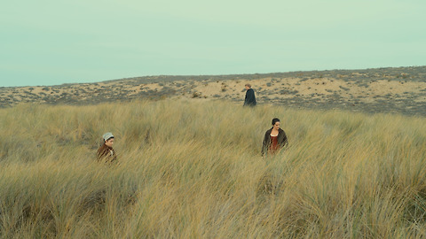

The name came before the idea. I heard it, more or less, on a podcast: an offhand remark about horror climbing from YouTube to the multiplex, about work made by amateurs on a video platform being taken up as real cinema. The phrase that lodged itself in my head was _cult to canon_, and I have been trying to earn it ever since. What follows is an attempt to say what the site is for while admitting how much of its own title I do not yet believe.

## Two substitutions

Most of the work was done by two lexical choices. The first put _canon_ where one might have said _classic_. A classic is a compliment; a canon is an institution. The word has a measuring rod within it, and to invoke it is to ask who is doing the measuring, by what rule, and at whose expense, because the same gesture that rules a work in rules others out.[^kanon] The second choice kept _to_ rather than _and_. _Cult and canon_ would name a pair; _cult to canon_ names a movement, a direction, a claim that things travel from the margins toward the center. I want to hold that claim at arm's length. It is the hypothesis the site exists to test, not the doctrine it exists to preach.

## What the two words carry

So I should say what I take the words to mean, knowing the meanings will shift under use. _Canon_, for my purposes, is the working set of things a culture keeps warm: taught, re-screened, re-pressed, argued over, quietly assumed. It is not a list that someone published but a process that never stops, and its byproduct is the apocryphal, everything the process lets go cold. _Cult_ is the other kind of keeping: devout, partial, and proud of its partiality. A cult object is loved intensely by comparatively few, and part of what they love is that the many do not. The two words share more than a stage. Both descend from a root meaning care or cultivation, the same root that gives us _culture_; both name a form of tending.[@williams-keywords] The difference between them is scale and sanction, not kind.[^cultus] That is the first thing the title oversimplifies, and the first thing worth saying plainly.

## The pipeline is a hypothesis

The title implies a sequence, and I do not believe the sequence is a law. Sometimes it runs. The clearest case I have is the one the site takes as its emblem: the _Backrooms_ began as a teenager's analog-horror videos and arrived, four years later, as a studio feature that earned back many times its budget. Sometimes it reverses, and the reversal is the more interesting event. When Taco Bell made its seasonal Nacho Fries permanent, it did not canonize them; it voided the thing that made them worth wanting, which was that they kept leaving. And very often the movement never happens at all, or happens in both directions at once. An object can be fully canonical in one register and invisible in another, or hold a cult and a canon simultaneously: a consecrated property that is also a furnished world, ramshackle enough for its devotees to quote it and reinhabit it.[@eco1985] I take this as a working position rather than a slogan. Canon and cult are less a sequence than a simultaneity, and the _to_ in the title is a question I mean to keep asking, not a road I have already mapped.

## Canonization is something people do

If canon is a process, then someone runs it, and this is the second thing I am willing to commit to: canons are made, not found. The works that endure are not simply the strong ones surviving on their merits; they are also the ones that institutions were positioned to keep teaching, printing, and screening. John Guillory argues that the quarrel over the canon was never really about which groups it represents, but about who has access to the means of literary production, above all through the education system.[@guillory1993] Pierre Bourdieu locates a work's value not in the work but in the field around it, in the critics and juries and curators whose recognition confers worth.[@bourdieu1993] Against them stands Harold Bloom, for whom the canon records aesthetic strength and little else, and who would call all of this sociology an evasion of the art itself.[@bloom1994] I do not think Bloom is simply wrong. A purely institutional account cannot explain why audiences walk away from consecrated things, or why a conferred value can be refused. But I think he is insufficient, and the honest posture is to treat canonization as work that people and institutions perform, and to treat myself, writing here, as one more small operator inside it rather than a judge standing outside.

## Whose canon

The next question is whose canon, and my honest answer is that the center of gravity is my own. The objects I actually attend to are contemporary and mostly low in status: horror, internet folk-literature, games, blockbusters, records, the ephemera of a life spent consuming. I do not think this is a retreat from the large question into a small one. Italo Calvino argued that the classics are the books that have never finished saying what they have to say, and that the personal canon and the public one are the same question asked at different volumes.[@calvino-classics] Borges put it more strangely in "Kafka and His Precursors": each writer creates his own precursors, so that a canon is retroactive, assembled backward from wherever one happens to stand. I am standing in 2026, in front of a screen, and the canon I can see from here is the one I am obliged to write about.

A personal center is not a license to forget the rest, and three pressures keep the personal frame honest. The first is inherited. When I argue that a work belongs or does not, I am using a machine built by T. S. Eliot and his heirs: the idea that tradition is a living order that each genuine addition quietly rearranges.[@eliot-tradition] I work with that machine and against it, but I did not invent it. The second pressure is comparative. The European canon-theory I absorbed by default pretended to be universal, and it was not. Classical Chinese criticism produced explicit ranked gradings of poets centuries before the West had anything comparable; classical Sanskrit poetics located a work's worth not in imitation but in suggestion and in _rasa_, felt aesthetic flavor.[@owen-readings] A little of this does not make me a comparatist, but it denaturalizes the criteria I would otherwise treat as given and reminds me that _good_ is a local word.[^comparative] The third pressure cuts closest. Every canon is chosen by someone, and its silences are not neutral. Chinua Achebe's reading of _Heart of Darkness_ showed how a securely canonical book could rest on the erasure of the people it used as scenery.[@achebe-image] Édouard Glissant offered the most useful alternative I know to the canon-as-closed-list: a poetics of relation, in which identity and value are built through connection rather than through isolation and ranking.[@glissant-relation] I do not resolve these pressures here. I only promise not to write as though they were absent.

## What the site is, and does

That promise is easier to keep because the site is built to hold me to it. This is not a journal of verdicts. It is closer to a workbench, or to an archive trying to behave like a canon. Each piece is a small intervention in the process described above, and the apparatus around each piece is part of the argument. The Marginalia, where footnotes and citations and version history sit beside the text, is a working realization of what Gérard Genette called paratext: the thresholds and margins through which a reader actually approaches a work.[@genette-paratexts] The `confidence` field on every post is a discipline of honesty, forcing me to say how much I believe a claim and letting me be wrong on the record and revise in public. Aleida Assmann distinguishes the canon, the small store a culture keeps in active use, from the archive, the larger store it merely keeps.[@assmann2008] This site is quite literally an archive attempting the work of a canon, and the friction between those two ambitions is much of its subject.[^weaning]

Not every piece will reach a verdict, and they will not all sound alike. There will be fragments, notes, reviews, the occasional fiction, and fully built essays, and the register will move from the lyrical to the polemical to the deadpan as the object demands. Susan Sontag is the model here more than any single argument of hers: a critic who took cult attention seriously, who could write about camp and about high seriousness without lowering her intelligence, only changing her voice.[@sontag-camp] Mark Fisher is the nearer model, a writer who treated pop culture as though the stakes were total and was usually right to.[@fisher-ghosts] What holds the site together is not a doctrine but two things: the concept, cult and canon and the traffic between them, and a single voice trying to be honest about its own taste. If the archive grows the way I hope, I should be able to look back and read, in what I chose to keep warm, a fairly exact portrait of who I was.

## Why now

Why do this now? Partly because the machinery of consecration is visibly changing: the gatekeepers have multiplied and half-dissolved, and the unit of canonization is no longer obviously the book or the film but might be the scene, the channel, the account, the microgenre. Partly because I want a place to think that is not a feed. And partly for a reason I can only state as a test. If I ever find that I have settled the questions underneath this essay, that I know for certain whose canon and what unit and whether the pipeline is real, then the site will have become the doctrine it was built to avoid, and it will be honest to close it. Until then the work is to keep the questions open and to answer them anyway, one object at a time.

[^kanon]: The word descends from the Greek _kanōn_, a measuring rod or rule, and hardened into its familiar sense through the closure of religious scripture: the councils and arguments that fixed which texts were authoritative and consigned the rest to the apocrypha. Bruce Metzger's history of the New Testament canon is the standard account; Jonathan Z. Smith's is the sharper point for my purposes, that canon is a generative category, a rule that compels endless interpretation of what it rules out.

[^cultus]: From the Latin _cultus_, care or cultivation or worship, by way of _colere_, to tend. Walter Burkert traces the older ritual sense in his work on Greek religion; the place to watch _cult_ and _culture_ drift apart from the same root is Williams's vocabulary itself.

[^comparative]: The risk in this move is tokenism: parading three non-Western traditions as ornament and returning, unchanged, to the Western default. The guard against it is to use them for their criteria rather than their color, letting _rasa_ or the graded poet-rankings actually contest what "value" is allowed to mean, and to admit plainly where my reading is shallow.

[^weaning]: The apparatus is provisional by design, and so is my reliance on it. The `confidence` field, the version history, and the Marginalia are scaffolding I would rather learn to need less of over time; naming that here is a way of keeping the scaffolding from hardening into the point.

::: citations 
williams-keywords | Raymond Williams | Keywords: A Vocabulary of Culture and Society | 1976 | https://en.wikipedia.org/wiki/Keywords:_A_Vocabulary_of_Culture_and_Society 
eco1985 | Umberto Eco | Casablanca: Cult Movies and Intertextual Collage | 1985 | https://www.jstor.org/stable/3685047 
guillory1993 | John Guillory | Cultural Capital: The Problem of Literary Canon Formation | 1993 | https://press.uchicago.edu/ucp/books/book/chicago/C/bo209142619.html 
bourdieu1993 | Pierre Bourdieu | The Field of Cultural Production | 1993 | https://cup.columbia.edu/book/the-field-of-cultural-production/9780231082877/ 
bloom1994 | Harold Bloom | The Western Canon: The Books and School of the Ages | 1994 | https://en.wikipedia.org/wiki/The_Western_Canon 
calvino-classics | Italo Calvino | Why Read the Classics? | 1991 | https://www.nybooks.com/articles/1986/10/09/why-read-the-classics/ 
eliot-tradition | T. S. Eliot | Tradition and the Individual Talent | 1919 | https://www.poetryfoundation.org/articles/69400/tradition-and-the-individual-talent 
owen-readings | Stephen Owen | Readings in Chinese Literary Thought | 1992 | https://www.hup.harvard.edu/books/9780674749214 
achebe-image | Chinua Achebe | An Image of Africa: Racism in Conrad's Heart of Darkness | 1977 | https://en.wikipedia.org/wiki/An_Image_of_Africa 
glissant-relation | Édouard Glissant | Poetics of Relation | 1990 | https://press.umich.edu/Books/P/Poetics-of-Relation 
genette-paratexts | Gérard Genette | Paratexts: Thresholds of Interpretation | 1997 | https://archive.org/details/paratextsthresho0000gene 
assmann2008 | Aleida Assmann | Canon and Archive | 2008 | https://doi.org/10.1515/9783110207262.2.97 
sontag-camp | Susan Sontag | Notes on "Camp" | 1964 | https://en.wikipedia.org/wiki/Camp_(style) 
fisher-ghosts | Mark Fisher | Ghosts of My Life: Writings on Depression, Hauntology and Lost Futures | 2014 | https://www.collectiveinkbooks.com/zer0-books/our-books/ghosts-my-life 
:::
